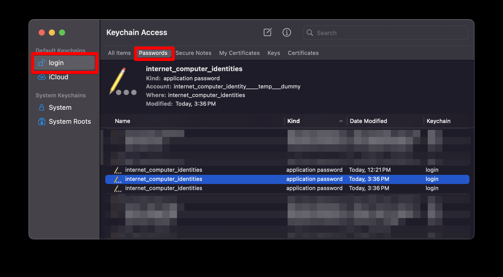
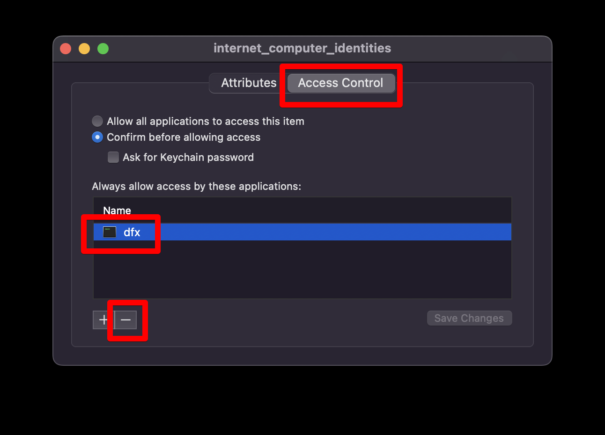

# dfx 0.28.0 migration guide

## Keychain issues on macOS arm64

This release brings the first arm64 macOS version of `dfx`. On arm64 macOS, there is an issue that prevents `dfx` from accessing identities stored in the keychain if an x64 version of `dfx` also has access to it. In order to restore arm64 `dfx`'s access to identities, you will need to remove x64 `dfx`'s access.

You may want to export identities first using the previous version of dfx in case you make a mistake:

```
dfx +<older-version> identity export <identity-name>
```

First, open the "Keychain Access" application. You may see a popup telling you to try a different "Passwords" app instead, ignore it and open "Keychain Access".

Next, scroll through the "Passwords" section of the "login" keychain. If it is blank, try switching to a different keychain, and then switch back to "login". Find the two or more entries labeled `internet_computer_identities`.



For each `internet_computer_identities` entry you see (including the one marked `temp___dummy`), double-click it and switch to the "Access Control" tab. If you see `dfx` on that list, click it and then click the 'minus' button to remove it. If `dfx` shows up multiple times, remove each such entry. Finally, click "Save Changes".



After these steps, `dfx` should no longer give you this error. Note that fixing just one identity will not restore access to that identity unless you have also fixed the one marked `temp___dummy`.

If your workflow requires using multiple versions of dfx, note that this error will be re-created each time you "Always Allow" an x64 or pre-0.28 version of dfx to access your identities.
