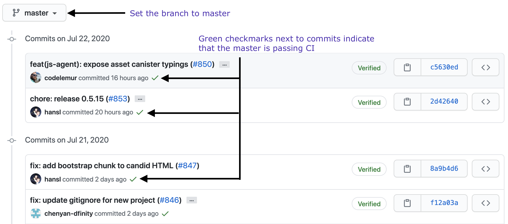
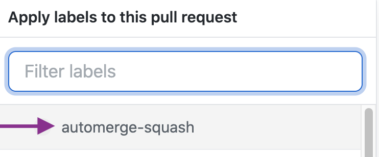

= Release process

This document describes the release process for the DFINITY SDK, with step-by-step instructions, information about automation, and a checklist.

== Overview

Before starting the release process, the team should conduct a brief Go/No-Go release review to evaluate the current state of fixes and features ready to be included in a release candidate.
After reviewing the list of fixes and features, the team will decide whether to proceed with staging a build.

If the new release is given the Go green light, two people who are familiar with the process—a *driver* and a *validator*—use the checklist in this document to stage or promote a release candidate.

The *validator* should be the person most familiar with the process and be able to assist with debugging or resolving issues if the *driver* building the release runs into trouble.

A successful release is the result of coordination between automation, manual steps performed by team members, and a validation process.
Our goal is to update this document with the latest information as we iterate to improve the release process.

== Checklist
Use this checklist to prepare a release candidate.

=== Participants
- Driver
- Validator

=== Prerequisites

Before you begin, verify the following prerequisites for the release process *driver*:

- You must have a GitHub account and access to the `+dfinity-lab+` repositories.
+
For information about setting up a GitHub account, see link:
To get permission for your account to access `+dfinity-lab+` and `+dfinity+` repositories, contact IT using the #help-it Slack channel or submit a JIRA ticket.

- You must have VPN access to the DFINITY VPN.
+
If you don't have a VPN connection set up for your computer, you'll need to follow the instructions in link:https://www.notion.so/How-to-get-VPN-access-to-our-data-center-services-1c9b123152d740508eec25e7ac982259[How to get VPN access to our data center services].

- You must have Nix installed and configured.
+
NOTE: If you are installing Nix for the first time, building the cache can take hours and might timeout depending on the reliability of your network connection.

- You must have a registered NPM account.
+
If you don't have an account, you can go to the link:https://www.npmjs.com/[NPMJS] website and click *Sign Up* to create one using your `firstname.lastname@dfinity.org` email address.
+
You will need to verify your email address to complete the registration process.
For your account to be added to the `dfinity` organization, contact Hans or Stanley.

=== Preliminary validation

Verify the general stability of the master branch before attempting to create a release candidate.

. Use this link:https://github.com/dfinity-lab/sdk/commits/master[link]
to verify:
.. Is `master` green?
.. Was `master` red recently or flaky?
+

=== Start preparing a new release

. Connect to VPN.

. Open a terminal and `cd` into your local copy of the `sdk` repo.
. Checkout the `master` branch and pull from remote.
+
[source, bash]
----
git checkout master && git pull
----

=== Build DFX and the JavaScript agent binaries

Verify that you can build DFX and the JavaScript agent from the `+master+` branch without errors.

. Build the `dfx` binary by running the following command:
+
[source, bash]
----
nix-build ./dfx.nix -A build --option extra-binary-caches https://nix.dfinity.systems
----
+
This command prints logs to the console.
The last line printed is the build output directory. 
+
For example, you should see a path similar to this:
+
`/nix/store/7qsrb3pikzam301h6khjzwpg35ry7miz-dfinity-sdk-rust-unknown`
. Copy the `/nix/store/...-dfinity-sdk-rust-unknown` path displayed in the console.
// (_for the rest of these instructions, assume that `dfx` is a reference to
// `result/bin/dfx or wherever the binary was built with this command`_)
. Create a temporary `alias` for the binary to use in successive steps by appending `/bin/dfx` to the `/nix/store/...-dfinity-sdk-rust-unknown` path.
+
For example, add `/bin/dfx` to the `/nix/store/...-dfinity-sdk-rust-unknown` path to create an alias by running a command similar to the following: 
+
[source, bash]
----
alias dfx=/nix/store/7qsrb3pikzam301h6khjzwpg35ry7miz-dfinity-sdk-rust-unknown/bin/dfx
----
. Verify the binary version by running the following command:
+
[source, bash]
----
dfx --version
----
. Delete the existing `dfx` cache to ensure you're not using a stale binary.
+
[source, bash]
----
dfx cache delete
----
. Build the JavaScript agent by running the following command:
+
[source, bash]
----
nix-build . -A agent-js --option extra-binary-caches https://nix.dfinity.systems
----
+
This command prints logs to the console.
The last line printed is the build output directory. 
+
For example, you should see a path similar to the following:
+
`/nix/store/s9al333cb07lgzjl90hy3c5n9p59380p-dfinity-sdk-agent-js`
. Copy the `/nix/store/...-dfinity-sdk-agent-js` path displayed in the console.
. List the files in the `/nix/store/...-dfinity-sdk-agent-js` path by running a command similar to the following:
+
[source, bash]
----
ls -l /nix/store/s9al333cb07lgzjl90hy3c5n9p59380p-dfinity-sdk-agent-js
----
+
You should see output similar to the following:
+
....
total 64
-r--r--r--  1 username  admin  30439 Dec 31  1969 dfinity-agent-0.6.0.tgz
dr-xr-xr-x  4 username  admin    128 Dec 31  1969 nix-support
....
. Append the `/nix/store/` path with the `dfinity-agent-n.n.n.tgz` file name and
store the full path to the archive (`.tgz`) file in a temporary environment variable by running a command similar to the following:
+
[source, bash]
----
export JS_AGENT_PATH=/nix/store/s9al333cb07lgzjl90hy3c5n9p59380p-dfinity-sdk-agent-js/dfinity-agent-0.6.0.tgz
----
. Ensure `dfx` and `replica` are not running in the background by running the following commands:
+
[source, bash]
----
ps -ef | grep replica
ps -ef | grep dfx
----
+
These commands should only list `+grep+` as a running process. 
If there are any `replica` or `dfx` processes running, use the `kill` command to terminate them.

=== Validate the default project

Verify that you can build, deploy, and call the default `hello_world` project without errors.

. Generate a default new project.
+
[source, bash]
----
dfx new hello_world
cd hello_world
----
. Install the locally-built JavaScript agent for the new project.
+
[source, bash]
----
npm install ${JS_AGENT_PATH}
----
. Start the local `replica` as a background process.
+
[source, bash]
----
dfx start --background
----
. Create, build, and install canisters by running the following commands:
+
[source, bash]
----
dfx canister create --all
dfx build
dfx canister install --all
----
. Call the canister and verify the result.
+
[source, bash]
----
dfx canister call hello_world greet everyone
----
. Verify the default front-end in a browser.
.. In a new incognito or private window, navigate to the default localhost address and port `8000` as specified in the `dfx.json` configuration file.
.. Append `?canisterId=ic:<YOUR-CANISTER-IDENTIFIER>` with the canister identifier for the
`hello_world_assets` canister to the URL (for example, `http://localhost:8000/?canisterId=ic:02000000000000000000000000000000000153`).
.. Verify that you are prompted to type a greeting in a prompt window.
.. Type a greeting, then click *OK* to return the greeting in an alert window.
.. Verify there are no errors in the console by opening the Developer Tools.
+
For example, in the browser, right-click>, then click Inspect and select Console to check for errors and warnings. 
Warnings can be ignored.

. Verify the Candid UI.
.. In a new incognito or private window, navigate to the default localhost address and port `8000` as specified in the `dfx.json` configuration file.
.. Append the `candid` endpoint and `canisterId` for the `hello_world` canister to the URL (for example, `http://localhost:8000/candid?canisterId=ic:0100000000000000000000000000000000012D`).
.. Verify UI loads, then test the greet function by entering text and clicking *Call* or clicking *Lucky*,
.. Verify there are no errors in the console by opening the Developer Tools.
+
For example, in the browser, right-click>, then click Inspect and select Console to check for errors and warnings. 
Warnings can be ignored.
. Stop the replica by running the following command:
+
[source, bash]
----
dfx stop
----
. Delete the test project by running the following commands:
+
[source, bash]
----
cd ..
rm -rf hello_world
----

==== Update the version

. Navigate back to the top-level of the `sdk` repo.
. Enter the sdk `nix` development environment by running the following command:
+
[source, bash]
----
nix-shell
----
. Create a new branch for your changes by running the following commands:
+
[source, nix-shell]
----
git switch -c <YOUR_NAME>/<BRANCH-FOR-NEW_DFX_VERSION>
----
. Update the `version` field for the following files:
+
....
`src/dfx/Cargo.toml`
`src/agent/rust/Cargo.toml`
`src/ic_identity_manager/Cargo.toml`
....
. Apply these changes to `Cargo.lock` by running the following command:
+
[source, nix-shell]
----
cargo build
----
. Set the new version in a temporary environment variable.
+
For example, replace `<n.n.n>` with a specific version number:
+
[source, nix-shell]
----
export NEW_DFX_VERSION=<n.n.n>
----
. Update the `@dfinity/agent` JavaScript package by running the following command:
+
[source, nix-shell]
----
cd src/agent/javascript/ && npm version ${NEW_DFX_VERSION}
----
. Navigate back to the root of sdk repo by running the following command: 
+
[source, nix-shell]
----
cd ../../..
----
. Update the `@dfinity/bootstrap` JavaScript package by running the following command:
+
[source, nix-shell]
----
cd src/bootstrap/ && npm version ${NEW_DFX_VERSION}
----
. Navigate back to the root of sdk repo by running the following command: 
+
[source, nix-shell]
----
cd ../..
----
. Append the new version to `public/manifest.json` by adding it to the `versions` list.
+
For example:
+
[source, json]
----
{
    "tags": {
        "latest": "0.6.0"
    },
    "versions": [
        "0.5.15",
        "0.6.0",
        "n.n.n"
    ]
}
----
+
*Ensure* `latest` remains the same.

==== Create a pull request and tag 

. Create a pull request with the above changes by running the following commands:
+
[source, bash]
----
git add --all
git commit --signoff --message "chore: Release `NEW_DFX_VERSION`"
git push origin <YOUR_NAME>/<BRANCH-FOR-NEW_DFX_VERSION>
----
. After pushing, click the link in the console to go to your new branch in GitHub, then click *Create Pull Request*.
. Have the validator review and approve the PR.
. Apply the `automerge-squash` label.
+

. Wait for the pull request to get merged.
+
NOTE: Depending on the number of jobs queued up, this step can take 45 to 60 minutes to complete.

. Switch to the `stable` branch by running the following command:
+
[source, bash]
----
git switch stable
----
. Pull the remote `stable` branch into your local `stable` branch by running the following command:
+
[source, bash]
----
git pull origin stable
----
. Pull the merged changes into the `stable` branch by running the following command:
+
[source, bash]
----
git pull origin master --ff-only
----
. Create a new tag by running the following command:
+
[source, bash]
----
git tag --annotate ${NEW_DFX_VERSION} --message "Release: `${NEW_DFX_VERSION}`"
----
. Verify the tag points to the correct version and includes annotation by running the following commands:
+
[source, bash]
----
git log
git describe --always
----
. Push the tag by running the following command:
+
[source, bash]
----
git push origin ${NEW_DFX_VERSION}
----
+
CI will only publish `dfx` from the latest commit from the `stable` branch when that commit is tagged with a version.
. Push the `stable` branch by running the following command:
+
[source, bash]
----
git push origin stable
----
+
Pushing the branch second is an optimization.
Hydra will spur into action when `stable` advances, so if the branch is already tagged, it won't require a second fetch.

==== Publish Javascript agent to NPM

. Change to the `javascript` agent directory and clean it by running the following commands:
+
[source, nix-shell]
----
cd src/agent/javascript
git clean -dfx .
----
. Make sure you have latest version of node modules and don't have stale files by running the following command:
+
[source, nix-shell]
----
npm install
----
. Build files by running the following command:
+
[source, nix-shell]
----
npm run build
----
. Run the following command to check that every `.js` file has a `.d.ts` assigned and that every `.js` and `.d.ts` file has a source file that is not a test:
+
[source, nix-shell]
----
diff <(find types src \( -name \*.d.ts -o -name \*.js \) -a \! -name \*.test.\* | sort) <(npm publish --dry-run 2>&1 | egrep 'npm notice [0-9.]*k?B' | awk '{ print $4 }' | grep -v package.json | grep -v README.md | sort) && echo Success
----
+
You should see `Success` displayed in the terminal after running this command.
. Log in to npm by running the following command:
+
[source, nix-shell]
----
npm login
----
. Publish to npm by running the following command:
+
[source, nix-shell]
----
npm publish
----
. Log out by running the following command:
+
[source, nix-shell]
----
npm logout
----
ifdef::env-github[]
:tada:
endif::[]

==== Notification and post-build validation

. Wait for the automatic slack message to
link:https://dfinity.slack.com/archives/CUXGQBABF/p1594954197000100[_#build-notifications_]
about the successful publishing of the dfx tarballs.

. Install the build using the `DFX_VERSION=<version>` environment variable.
. Run through the link:https://staging--eloquent-poitras-af14f0.netlify.app/docs/quickstart/quickstart.html[_Quick start_] steps.
. Notify link:https://app.slack.com/client/T43F9UHS5/CGA566TPV[#eng-sdk] team members that the new build is ready for manual installation and testing.
. Update the link:https://docs.google.com/spreadsheets/d/1pIblGqIeqapzptOtDb4h0LjJKDFIYXRxJrX9VaphfjA/edit#gid=725289684[_release notes_] spreadsheet and documentation based on the Go/No-go list of merged PRs.
+
The driver only needs to add a tab to the spreadsheet.
The DX Product team will walk through the list of merged PRs and work with the team to generate release note content.

=== Promoting a released version to Latest

. Verify that release notes and documentation are ready for public consumption.
. Open the `public/manifest.json` file in a text editor.
. Under the `tags` key, change the version number associated with the `latest` key.
+
For example:
+
[source,json]
----
{
    "tags": {
        "latest": "n.n.n"
    }
}
----
. Prepare a PR for the manifest by running the following commands:
+
[source, bash]
----
git switch -c <YOUR_NAME>/update-n.n.n-latest
git add --all
git commit --message "chore: Update the manifest latest to n.n.n "
git push origin <YOUR_NAME>/update-n.n.n-latest
----
. After pushing, click the link in the console to go to your new branch in GitHub, then click *Create Pull Request*.
. Have the validator review and approve the PR, then merge to `master`.
. Verify the Linux and Darwin (macOS) builds are available for download from https://download.dfinity.systems/sdk/dfx.
+
Linux—Replace {DFX_VERSION} with the new version number:
+
link:https://download.dfinity.systems/sdk/dfx/{DFX_VERSION}/x86_64-linux/dfx-{DFX_VERSION}.tar.gz[]
+
Darwin (macOS)—Replace {DFX_VERSION} with the new version number:
+
link:https://download.dfinity.systems/sdk/dfx/{DFX_VERSION}/x86_64-darwin/dfx-{DFX_VERSION}.tar.gz[]
+
CI Hydra:
+
link:https://hydra.dfinity.systems/jobset/dfinity-ci-build/sdk-release[]

=== Release documentation

link:https://github.com/dfinity/docs[Documentation repo]

. Tag the documentation using `git tag -a <version> -m <documentation-archive-message>`.
. Publish the tag on the remote server using `git push origin <tagname>`.
. Deploy updated documentation using Netlify.

== Requirements and properties

 - Semi-automation
 - Consistent delivery
 - Validation
 - Rollback
 - Guardrails
 - Flexibility

== Build mechanism

Our build process is described in the `release.nix` derivation.
The `release.nix` derivation mainly invokes the `dfx-release` derivation passing the annotated tag on HEAD (which happens right now to be the stable branch).
The `dfx-release` derivation builds the release binaries and files for each platform and generates a manifest for S3 that includes the tag name.
The release tag allows us to keep a directory structure with all past and upcoming releases in S3.

==  CI

CI release-related operation is split into two jobsets:

 - Generation and publishing of 'install.sh' and 'manifest.json'.
 - Tagging of a commit to release, building and publishing the necessary executables and files for supported platforms.

==  Manifest

We utilize a manifest to indicate to users (and in particular to our installer and dfx executable) available and supported versions for download.
The manifest allows us to rollback a release or remove a release from the list of supported releases.
See link:../specification/version_management{outfilesuffix}[Version Management] for details on the format of the manifest.

The manifest is generated when a patch is applied on master by the CI.

== Installer

The installer is generated when a patch is applied on the `master` branch by the CI.

==  Changelog

A candidate changelog is generated automatically using the respective tool (under scripts directory).
Currently, the release notes are updated manually in github.

== Publishing of artifacts

We now summarize the release process.
Our first step is to ensure the proper and valid state of the `master` branch.
Next, we update `cargo` and the manifest accordingly.
We then create and push an annotated tag on the `stable` branch, generate the changelog.
The product and SDK team members can then inspect, clarify, and develop the changelog to ensure it is appropriate for public
consumption.
After ensuring the proper artifacts are available in S3, we can now publish them by updating the manifest.

== TODOs and improvements
. version from the tag
. release stress tests
. valid json test for the manifest
